<!--
  ╔══════════════════════════════════════════════════════════╗
  ║  FILES NEEDED IN REPO ROOT:                             ║
  ║  • header.svg                                           ║
  ║  • divider.svg                                          ║
  ╚══════════════════════════════════════════════════════════╝
-->

<div align="center">
  
</div>

<br/>

<div align="center">

[](https://git.io/typing-svg)

<br/>


&nbsp;&nbsp;

&nbsp;&nbsp;


</div>

<br/><br/>

<div align="center"></div>

<br/>

## &nbsp;About Me

```
$ whoami

  ┌─────────────────────────────────────────────────────────────┐
  │  Shawn Kieffer Goyena  ·  skeg-16  ·  Manila, Philippines  │
  │  Computer Science Student → Aspiring Full-Stack Developer   │
  └─────────────────────────────────────────────────────────────┘

$ cat focus.txt

  ▸  Full-Stack Web Development
  ▸  Database Design & Architecture
  ▸  System Design & Clean Code Practices
  ▸  Software Engineering Fundamentals

$ cat availability.txt

  Open to: Project Collaborations · Open Source · Internships & Dev Roles

$ cat philosophy.txt

  "The strongest version of yourself is built in the dark —
   failed builds, slow progress, and the grind you almost gave up on."
```

<br/>

<div align="center"></div>

<br/>

## &nbsp;Tech Stack

<div align="center">

<br/>

**`Languages`**

[](https://skillicons.dev)

<br/>

**`Databases`**

[](https://skillicons.dev)

<br/>

**`Tools & Environment`**

[](https://skillicons.dev)

<br/>

</div>

<div align="center"></div>

<br/>

## &nbsp;GitHub Stats

<div align="center">

<br/>


&nbsp;&nbsp;


<br/><br/>


<br/>

</div>

<br/>

<div align="center"></div>

<br/>

## &nbsp;Contribution Snake

<div align="center">

<br/>

<picture>
  <source media="(prefers-color-scheme: dark)"
    srcset="https://raw.githubusercontent.com/skeg-16/skeg-16/output/github-contribution-grid-snake-dark.svg"/>
  <source media="(prefers-color-scheme: light)"
    srcset="https://raw.githubusercontent.com/skeg-16/skeg-16/output/github-contribution-grid-snake.svg"/>
  
</picture>

<br/>

</div>

<div align="center"></div>

<br/>

## &nbsp;Coding Activity

<!--START_SECTION:waka-->


**I'm a Night 🦉** 

```text
🌞 Morning                5 commits           █░░░░░░░░░░░░░░░░░░░░░░░░   02.67 % 
🌆 Daytime                86 commits          ███████████░░░░░░░░░░░░░░   45.99 % 
🌃 Evening                75 commits          ██████████░░░░░░░░░░░░░░░   40.11 % 
🌙 Night                  21 commits          ███░░░░░░░░░░░░░░░░░░░░░░   11.23 % 
```
📅 **I'm Most Productive on Wednesday** 

```text
Monday                   35 commits          █████░░░░░░░░░░░░░░░░░░░░   18.72 % 
Tuesday                  20 commits          ███░░░░░░░░░░░░░░░░░░░░░░   10.70 % 
Wednesday                53 commits          ███████░░░░░░░░░░░░░░░░░░   28.34 % 
Thursday                 30 commits          ████░░░░░░░░░░░░░░░░░░░░░   16.04 % 
Friday                   27 commits          ████░░░░░░░░░░░░░░░░░░░░░   14.44 % 
Saturday                 10 commits          █░░░░░░░░░░░░░░░░░░░░░░░░   05.35 % 
Sunday                   12 commits          ██░░░░░░░░░░░░░░░░░░░░░░░   06.42 % 
```

📊 **This Week I Spent My Time On** 

```text
🕑︎ Time Zone: Asia/Manila

💬 Programming Languages: 
No Activity Tracked This Week

🔥 Editors: 
No Activity Tracked This Week

🐱‍💻 Projects: 
No Activity Tracked This Week

💻 Operating System: 
No Activity Tracked This Week
```

Last Updated on 04/04/2026 16:39:01 UTC
<!--END_SECTION:waka-->

<br/>

<div align="center"></div>

<br/>

## &nbsp;Now Playing

<div align="center">

<br/>

[](https://spotify-recently-played-readme.vercel.app/api?user=313yvdam4tmxx53ypd7gwvxfkt7i)

<br/>

</div>

<div align="center"></div>

<br/>

## &nbsp;Connect

<div align="center">

<br/>

<p>Open to collaborations, freelance projects, and professional conversations.<br/>Let's build something meaningful.</p>

<br/>

[](https://facebook.com/g.shawnkieffergoyena)
&nbsp;
[](https://linkedin.com/in/shawn-kieffer-goyena-csswb-574866275)
&nbsp;
[](https://github.com/skeg-16)

<br/>

[](YOUR_INSTAGRAM_URL_HERE)
&nbsp;
[](YOUR_TIKTOK_URL_HERE)
&nbsp;
[](YOUR_FB_PAGE_URL_HERE)

<br/>

</div>

<div align="center">
  
  <br/><br/>
  <sub>Built with precision. Maintained with discipline.</sub>
  <br/><br/>
</div>
